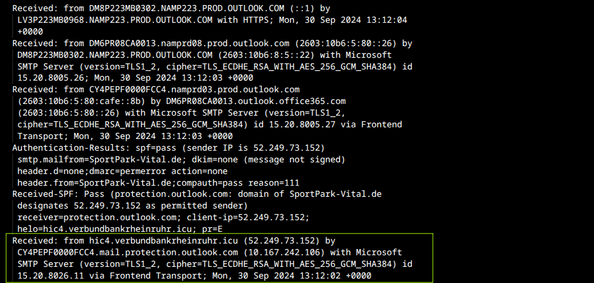
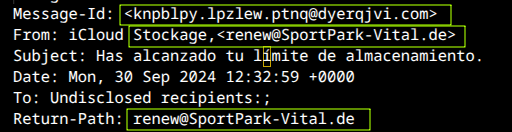
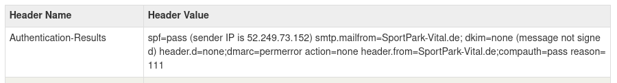
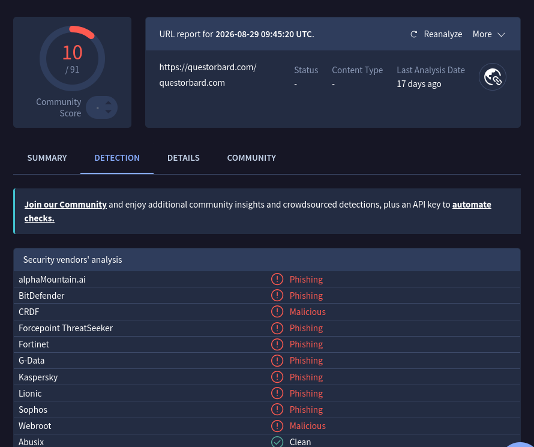

# Relatório de Análise de Phishing — INC-001

## 1. Resumo Executivo

E-mail recebido se passando pela Apple/iCloud, alegando limite de armazenamento atingido e solicitando upgrade de plano. Trata-se de **phishing confirmado** de baixa sofisticação técnica: o atacante não tentou forjar o domínio da Apple, mas o cabeçalho apresenta divergências claras entre remetente alegado e origem real, e o link do corpo (ofuscado via bit.ly) aponta para um domínio já confirmado como malicioso por múltiplos fornecedores de segurança.

## 2. Dados do E-mail

| Campo                                    | Valor                                        |
| ---------------------------------------- | -------------------------------------------- |
| Remetente alegado                        | Apple iCloud ("iCloud Stockage")             |
| Remetente real (From)                    | `renew@SportPark-Vital.de`                   |
| Return-Path                              | `renew@SportPark-Vital.de`                   |
| Message-ID                               | `<knpblpy.lpzlew.ptnq@dyerqjvi.com>`         |
| Assunto                                  | "Has alcanzado tu límite de almacenamiento." |
| Data                                     | Mon, 30 Sep 2024 13:12:59 +0000              |
| IP de origem                             | 52.249.73.152                                |
| Domínio de origem (Received mais antigo) | `hic4.verbundbankrheinruhr.icu`              |

## 3. Resultado da Autenticação

| Mecanismo | Resultado                 | Observação                                                                                                                    |
| --------- | ------------------------- | ----------------------------------------------------------------------------------------------------------------------------- |
| SPF       | `pass`                    | Autentica apenas que `52.249.73.152` está autorizado a enviar por `SportPark-Vital.de` — **não valida legitimidade da Apple** |
| DKIM      | `none`                    | Mensagem não assinada digitalmente                                                                                            |
| DMARC     | `permerror` (action=none) | Política mal configurada/ausente no domínio remetente, sem enforcement                                                        |

**Interpretação:** o SPF passar é irrelevante para o veredito. O atacante é dono de `SportPark-Vital.de` e autenticou corretamente a si mesmo — ele nunca tentou se passar tecnicamente pelo domínio da Apple. O ataque está inteiro no **display name spoofing** ("iCloud Stockage") e na engenharia social do corpo, não na falsificação de autenticação.

## 4. Indicadores de Comprometimento (IOCs)

```csv
tipo,valor,contexto,fonte,confianca
ip,52.249.73.152,IP de origem (Received mais antigo, autorizado por SPF),Análise de header,alta
dominio,SportPark-Vital.de,Domínio do remetente real (From/Return-Path),Análise de header,alta
dominio,hic4.verbundbankrheinruhr.icu,Domínio do servidor de origem na cadeia Received,Análise de header,alta
dominio,dyerqjvi.com,Domínio do Message-ID (não relacionado à Apple),Análise de header,media
url,hxxps://bit[.]ly/3Y5sooR,Link encurtado embutido nas imagens do corpo,Corpo do e-mail,alta
url,hxxps://bit[.]ly/3ZKNn1w,Segundo link encurtado embutido no corpo,Corpo do e-mail,alta
dominio,questorbard[.]com,Destino final apontado como phishing por múltiplos vendors,VirusTotal,alta
```

## 5. Análise Técnica

### 5.1 Cabeçalho

A cadeia `Received:` mostra o e-mail entrando na infraestrutura Microsoft/Outlook (frontend transport) vindo de `hic4.verbundbankrheinruhr.icu` (52.249.73.152) — nenhuma relação com domínios da Apple/iCloud.

**Figura 1 — Cadeia `Received:` completa, com origem destacada (domínio sem relação com Apple/iCloud):**



A divergência entre `From:` (alegando ser iCloud), `Return-Path:` e `Message-Id:` (ambos em domínios completamente distintos entre si — `SportPark-Vital.de` e `dyerqjvi.com`) reforça infraestrutura forjada e não relacionada à identidade alegada.

**Figura 2 — Campos `Message-Id`, `From` e `Return-Path`, todos incoerentes entre si e com a identidade alegada (Apple):**



### 5.2 Autenticação (evidência)

**Figura 3 — Resultado de `Authentication-Results` (SPF pass / DKIM none / DMARC permerror):**



### 5.3 URL

O corpo do e-mail usa imagens hospedadas em `i.imgur.com` (recurso legítimo abusado para parecer visual autêntico da Apple), todas envolvidas por links `bit.ly` — técnica clássica de ofuscação para esconder o domínio final até o clique. Ao expandir os links, o destino resolvido é `questorbard.com`. Consulta ao VirusTotal identificou 10 de 91 fornecedores de segurança sinalizando o domínio como **Phishing/Malicious** (incluindo BitDefender, Fortinet, Kaspersky, Sophos, Webroot), com última análise há 17 dias — domínio já mapeado e conhecido por campanhas de phishing. No momento da análise, o domínio estava indisponível (provavelmente takedown ou pausa de campanha).

**Figura 4 — Resultado do VirusTotal para o domínio de destino (`questorbard.com`), classificado como Phishing/Malicious por múltiplos vendors:**



### 5.4 Anexos

Não foram identificados anexos no e-mail. O vetor de ataque é exclusivamente via link, direcionado para captura de credenciais e/ou distribuição de malware na página de destino.

## 6. Técnicas MITRE ATT\&CK Identificadas

* **T1566.002** — Phishing: Spearphishing Link (vetor de entrega via link malicioso)
* **T1204.001** — User Execution: Malicious Link (dependência da ação do usuário clicando no link)
* **T1036.005** — Masquerading: Match Legitimate Name or Location (uso do nome/visual "iCloud" sem relação com o domínio real)

## 7. Veredito Final

**Phishing confirmado.** Baixa sofisticação técnica (sem spoofing real de domínio, sem anexo, sem evasão avançada), mas engenharia social convincente via marca Apple e ofuscação de URL via encurtador. Domínio de destino corroborado como malicioso por fontes externas independentes (VirusTotal).

## 8. Recomendações

* Bloquear domínio `SportPark-Vital.de` e `questorbard.com` em filtros de e-mail/proxy
* Bloquear IP `52.249.73.152` em firewall/e-mail gateway
* Adicionar os links `bit.ly/3Y5sooR` e `bit.ly/3ZKNn1w` à blocklist de URLs
* Orientar usuários sobre a técnica: nomes de exibição não são garantia de identidade — sempre conferir o endereço real do remetente
* Nenhuma credencial foi inserida nesta simulação; caso real exigiria checar logs de acesso e, se necessário, forçar reset de credenciais dos destinatários que clicaram
